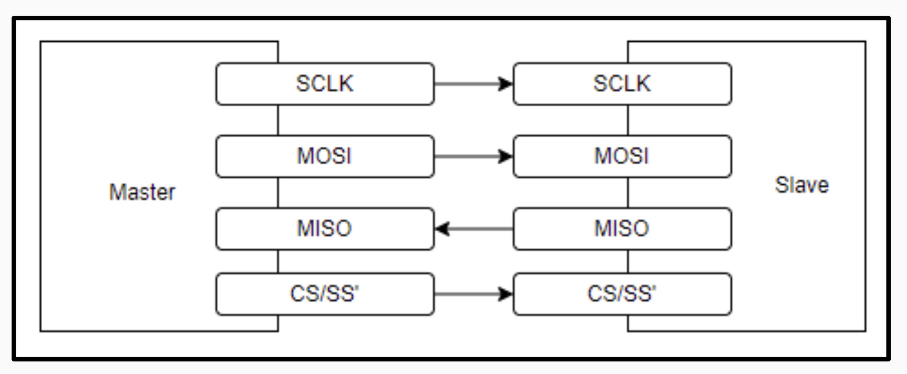
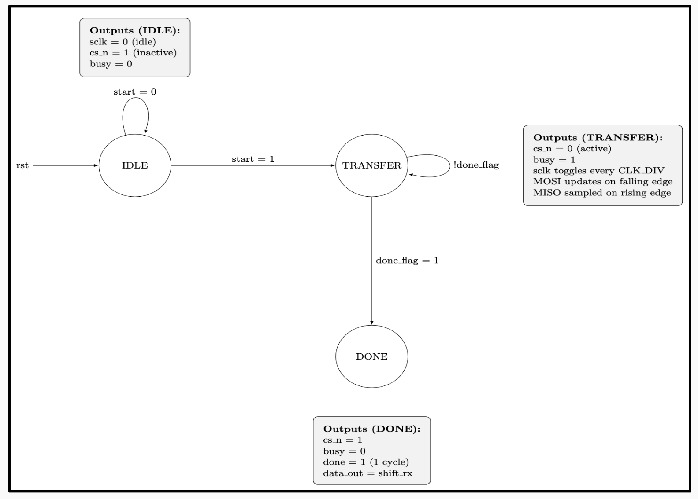
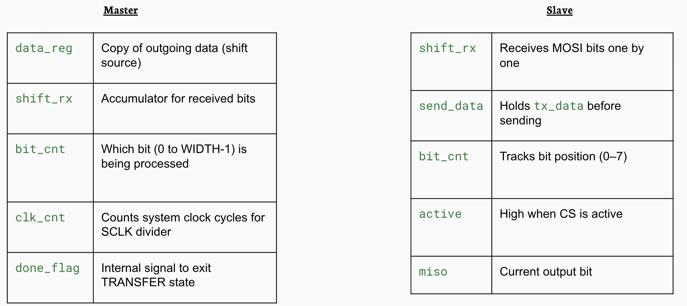
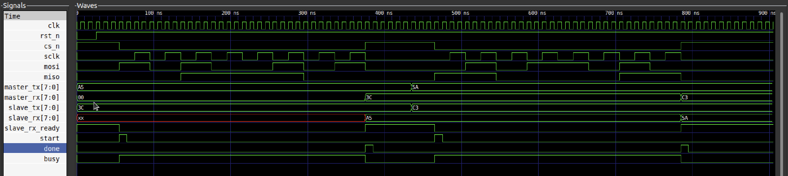

# SPI Protocol Implementation in Verilog

## Overview  
This project implements the **Serial Peripheral Interface (SPI)** protocol completely in **Verilog**, simulating communication between a **Master** and a **Slave** device.  
It follows **SPI Mode 0 (CPOL = 0, CPHA = 0)** and demonstrates accurate bit-level synchronization, data exchange, and control logic using digital design principles.

---

## Features  
-  Supports **SPI Mode 0** (Clock idle low, data sampled on rising edge)  
-  Fully functional **Master and Slave modules**  
-  8-bit **full-duplex communication**  
-  Status flags: `busy`, `done`, `start`, `slave_rx_ready`  
-  Compatible with **Icarus Verilog (iverilog)** and **GTKWave**  
-  Clear, timing-accurate waveform visualization  

---

## Protocol Basics  
SPI is a **synchronous serial communication** protocol used to connect microcontrollers and peripherals.  
It uses four main signals:

| Signal | Direction | Description |
|:--------|:-----------|:-------------|
| **MOSI** | Master → Slave | Master Out, Slave In |
| **MISO** | Slave → Master | Master In, Slave Out |
| **SCLK** | Master → Slave | Serial Clock |
| **CS_N** | Master → Slave | Chip Select (active low) |

**Mode 0 (CPOL=0, CPHA=0):**  
- Clock idles **LOW**  
- Data is **valid on the rising edge** of SCLK  

---

## Project Architecture

---

## MOSI FSM

---

## Internal Registers Used

---

## Ouput Waveform

---

## Project Structure
- ├── spi_master.v # SPI Master Module
- ├── spi_slave.v # SPI Slave Module
- ├── spi_tb.v # Testbench for simulation
- ├── master_synth.v # Master module synthesised netlist
- ├── slave_synth.v # Slave module synthesised netlist
- └── README.md

---

## Tools Used
- Icarus Verilog (iverilog) – for compilation
- GTKWave – for waveform visualization
- Yosys - for netlist generation

---

## Conclusion

This project accurately models the SPI protocol at the hardware (Verilog) level, showcasing clock synchronization, data exchange, and FSM-based control design.
It serves as a strong demonstration of digital communication and RTL design skills.

---

